# Agri-Hacks

A blog site for sharing Agriculture related hacks. Code Institute Portfolio 4 Assessment
#### - By FarmerEd

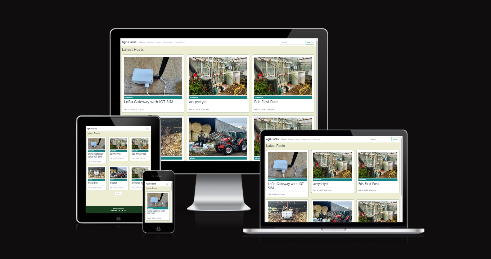
### **[Live Site:](https://agri-hacks-60be548e369f.herokuapp.com/)**  
### [Repository:](https://github.com/Farmer-Eds-Shed/Agri-Hacks/)

---

## Contents
<a name="contents"><a>
 1. [ User Experience UX ](#user-experience-ux)
 1. [Agile Development](#agile-development)
 1. [ Features ](#features)   
 1. [ Technology used ](#technology-used) 
 1. [ Testing ](#testing)  
 1. [ Bugs ](#bugs)  
 1. [ Deployment](#deployment)
 1. [ Credits](#credits)
 1. [ Acknowledgements](#acknowledgements)
 1. [ Content](#content)   

## User Experience UX

A visitor to Agri-Hacks would be a farmer looking to share their on farm innovation and labour saving hacks or a farmer simply looking for inspiration for projects to use on their own farms. All types of farm enterprises are welcome from back yard farmers to the largest enterprises.

### User Stories

#### Epic | Registration
- As a Site User I can register an account so that I can comment on and create new blog posts.
- As a Site Admin I can manage user accounts.

#### Epic | Categories
- As a site user I can group my posts so that other users can browse and filter similar content.
- As a User I can search so that I can easily find blogs of interest.
- As a site user, I can view a paginated list of posts so that I can select which post I want to view.
- As a Site Admin I can add/remove categories.

#### Epic | Functioning Blog CRUD
- As a Site User, I can click on a post so that I can read the full text.
- As a Site User I can create, read, update and delete my own posts so that I can manage my blog content.
- As a Site User I can create draft posts so that I can finish writing the content later.
- As a Site User I can see all post I created so that I can manage and track comments on past posts.
- As a Site User I can Upload Cover images so that I can showcase my blog.
- As a Site Admin I can create, read, update and delete posts so that I can moderate content.

#### Epic | Post Ranking
- As a Site User I can like blog posts so that popular posts can be ranked.
- As a Site User I can mark which blog posts I've made so that users can see what's being made.

#### Epic | About Page
- As a site user I can find an about page so that I can learn about the Site and provide feedback.
- As a Site User I can fill in a form so that I can provide feedback / report issues.
- As a Site Admin I can review/manage feedback so that I can review issues and general feedback on the site.
- As a Site Admin I can add/remove issue categories so that I can sort feedback.

#### Epic | Comments
- As a Site User I can view comments on an individual post so that I can read the conversation.
- As a Site User I can leave comments on a post so that I can be involved in the conversation.
- As a Site Admin I can create, read, update and delete posts so that I can moderate content.

#### User stories not yet implemented
The following user stories were scoped out of the project due to time constraints and labelled as "Won't Have Now" on the project board on GitHub. It is intended that these user stories will be implemented later.

- As a site user I can manage my own account so that I can update profile info/ passwords.
- As a Site User I can sort posts by popularity so that I can find the best projects.
- As a site user I can bookmark posts so that I can easily find them later.

[Back to Top of page](#contents)

### PLanning
- Database Structure

  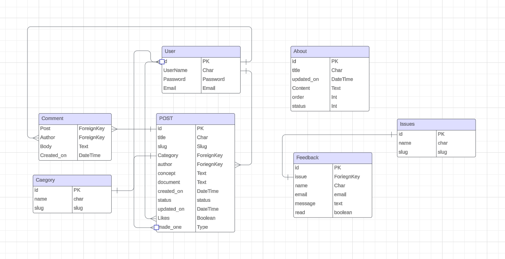

- Database Schema
    - #### Category Model

        | id | Field |
        |--|--|
        |name|TextField
        |slug|SlugField

    - #### Post Model

        | id | Field |
        |--|--|
        |title |Charfield|
        |category |ForeignKey|
        |author|ForeignKey|
        |featured_image|CloudinaryField|
        |concept|TextField|
        |document|TextField|
        |created_on|DateTimeField|
        |Status|IntegerField|
        |updated_on|DateTimeField
        |Likes|ManyToManyField
        |made_one|ManyToMany

    - #### Comment Model

        | id | Field
        |--|--|
        |post|ForeignKey
        |Author|ForeignKey
        |body|TextField
        |created_on|DateTimeField
        |updated_on|DateTimeField

    - #### About Model

        | id | Field
        |--|--|   
        |title|CharField
        |updated_on|DateTimeField
        |content|TextField
        |order|IntegerField
        |status|IntegerField

    - #### Issues Model

        | id | Field
        |--|--| 
        |name|CharField
        |slug|SlugField

    - #### Feedback Model

        | id | Field
        |--|--| 
        |issue|ForeignKey
        |name|CharField
        |email|EmailField
        |message|TextField
        |read|BooleanField

[Back to Top of page](#contents)

## Agile Development

This project was developed following the principles of Agile Development, GitHub Projects and Milestones were used to track planning and progress.  

User stories were created as Issues and assigned to a Milestone(Epic), progress was tracked via the projects board. Each user story was given an acceptance criteria to clearly define when it was completed.  

As User Stories were worked on they were moved into the "In Progress" section of the Project board, when a user story matched its acceptance criteria it was closed and moved the  "Done" section. When new features were decided upon after the initial project planning they were also added to the "To Do" Section. 

[Back to Top of page](#contents)

## Features

#### User based Features Implemented:

- **Users can** create an account **(Create)**
- **Users can** log into their account
- **Users can** log out of their account
- **Users can** create a blog post **(Create)**
- **Users can** read a blog post **(Read)**
- **Users can** edit their own posts **(Update)**
- **Users can** delete their own posts **(Delete)**
- **Users can** leave comments **(Create)**
- **Users can** read all comments **(Read)**
- **Users can** edit their own comments **(Update)**
- **Users can** delete their own comments **(Delete)**
- **Users can** like / unlike posts **(Update)**
- **Users can** mark / unmark projects they will/have made **(Update)**
- **Users can** read About page **(Read)**
- **Users can** contact site admins by contact form **(create)** 

#### Admin based features Implemented:

- **Admins can** moderate posts **(CRUD)**
- **Admins can** moderate comments **(CRUD)**
- **Admins can** Add / Remove Post Categories **(CRUD)**
- **Admins can** Review feedback **(CRUD)**
- **Admins can** Create new / update feedback issue categories **(CRUD)**
- **Admins can** Manage User Accounts **(CRUD)**
- **Admins can** Maintain the About Page **(CRUD)**

#### Account restrictions:

- **Users cannot** edit any other users posts
- **Users cannot** edit any other users comments
- **Users cannot** like/made_this the same post more than once
- **Users cannot** access the admin panel

### Site Features

Navbar

---

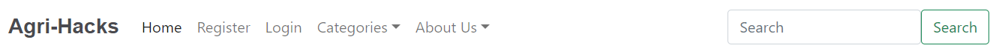
- With no user logged in the Navbar shows sign in and Register Buttons.

---

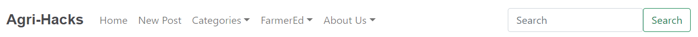
- Logged in users see a New Post link and a user dropdown. 

---

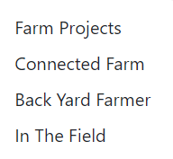
- The Categories Dropdown can be used to filter posts by category.
- The category list can be maintained by a site admin from the admin panel.

---

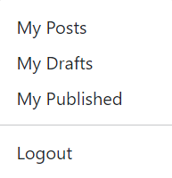
- The User dropdown can be used to filter the logged in users posts by:
 - All of their own posts.
 - Just their own published posts.
 - Just their own draft posts - other users cannot see the draft posts.
- The User dropdown also has a logout option

---

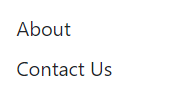
- The about dropdown contains links to:
 - The About page.
 - A contact form.
---

Search

---

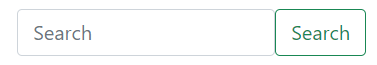
- The Search box in the right of the Navbar searches fields in the Post Model including:
 - Author
 - Title
 - Category

---
 

Index

---

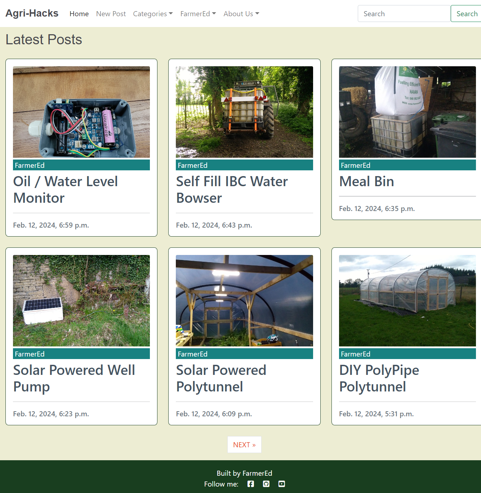
- This is the main landing page of the site:
 - Posts are arranged here with most recent first.
 - A max of 6 posts are displayed at a time.
 - Pagination is implemented and more posts can be found using the navigation buttons at the bottom.

---

Blog Post

---

- The main reading view for a blog post contains:
 - Project Description.
 - A like Button.
 - A Made_this button - for other posters who have or are building a similar project.
 - The Main build instructions for the project.
 - A comments Area.

---

New Post

---

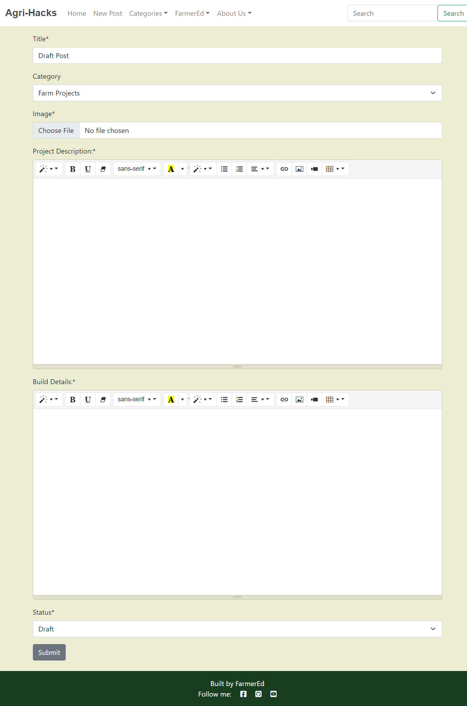
- The New post (and edit form) has fields to:
 - Add a Title.
 - Select a category.
 - Upload a featured image for page head and home screen.
 - Enter a project description with a rich text editor.
 - Enter the build details with a rich text editor.
 - Set post to Published if complete or leave in draft to publish later.
- The rich text editors can incorporate images and videos hosted on other platforms.
- The category list can be maintained by admins in the admin panel. 

---

About

---

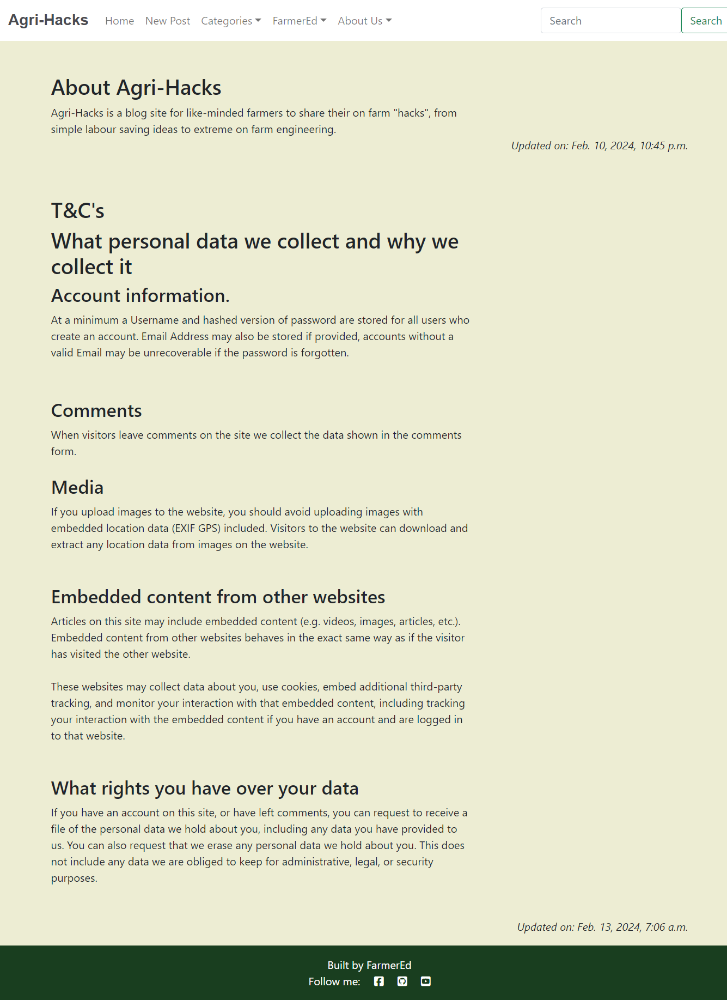
- The About Page is a place for users to get all information about the site.
- The page can be maintained and updated by Admins from the Admin Panel.
 - Sections can be set in order by an admin using a simple order integer.
 - Sections can be created, edited and deleted by admins

---

Contact Us

---

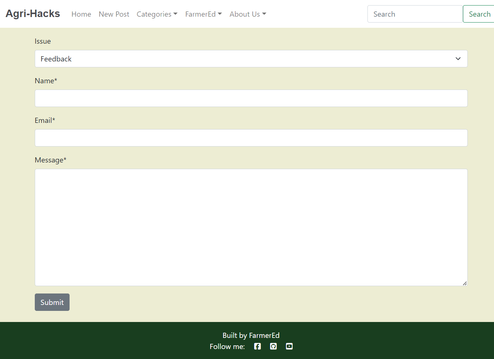
- The Contact / Feedback form has the following fields:
 - Select issue by type.
 - Name.
 - Email.
 - Message.
- From the admin panel admins can:
 - Maintain the list of issue types.
 - Read messages.
 - Mark messages as read.
 - edit / recategorize messages.
 - delete messages.

---

### Features Left to Implement

- User Account Management (Self Service). 
- Filter posts by popularity.
- Bookmark favourite Posts.

[Back to Top of page](#contents)

##  Technology Used

### Html

 - Used to structure webpages and the base templating language

### CSS

 - Custom CSS used to style the pages and give the site an agri theme.

### JavaScript

 -  Used to add comments CRUD functionality, like / made_this functions and to activate Bootstrap dropdown menus. 

### Python

 -  Used for the logic in this project.

### Django

 -  Framework used to build this project. Provides a ready installed admin panel and includes many helper template tags that make writing code quick and efficient.

### Font Awesome

 -  Icon library used for Icons on links and like buttons.

### Bootstrap 5
 - Used as the base front end framework to work alongside Django

### Jinja Templating with Django
 - Used to render logic within html documents and make the website more dynamic.

### HTMX
 - Used for Like / Made_this functionality, to avoid page refresh on click.

### GitHub
 - Used to store the code for this project & for the projects Kanban board used to complete it.

### Heroku
- Used to host and deploy this project

### Elephant PostgreSQL
-Heroku PostgreSQL was used as the database for this project during development and in production.

### Cloudinary
- Used to host the static files for this project including blog cover pictures.

### Git
- Used for version control throughout the project and to ensure a good clean record of work done was maintained.

[Back to Top of page](#contents)

---

## Testing

Manual testing was used through out the project development. Results of the final testing phase are shown below.

#### Account Registration Tests

| Test | Result |
|--|--|
|User can create account|Pass|
|User can log into account|Pass|
|User can log out of account|Pass|

---

#### User Navigation Tests

| Test | Result |
|--|--|
|User can navigate to each displayed blog post|Pass|
|User can navigate forwards through paginated lists|Pass|
|User can navigate backwards through paginated lists|Pass|
|User can access menu items|Pass|
|User can open dropdown menus|Pass|
|User can access each item in dropdown menus|pass|
|User can navigate to external sites in footer|pass|
|Admin can access admin panel|Pass|
|Dropdown menus auto close|pass|

---

#### Search Tests

| Test | Result |
|--|--|
|User can search posts by username|Pass|
|User can search posts by term in title|Pass|
|User can search posts by term in category|Pass|
|Blank search term returns all posts|Pass|

---

#### Security Tests

| Test | Returned | Result  |
|--|--|--|
|Non logged in user cannot create a new post by URL|Login Page|Pass|
|Non logged in user cannot edit posts by URL|Login Page|Pass|
|Non Logged in user cannot edit comments by URL|Login Page|Pass|
|Non Logged in user cannot delete comments by URL|Login Page|pass|
|Logged in user cannot edit other users comments by URL|Page reloads without accessing edit page|Pass - but could be improved with msg|
|Logged in user cannot delete other users comments by URL|Unauthorized Message |Pass|
|Logged in user cannot edit other users posts by URL|Unauthorized Message|Pass|
|Logged in user cannot delete other users posts by URL|Unauthorized Message|Pass|
|Non superuser cannot access admin panel|Admin Login Page|Pass|

---

#### Blog CRUD Tests

| Test |Result  |
|--|--|
|Logged in User can create a new post|Pass|
|Logged in user can edit their own posts|Pass|
|Logged in user can delete their own posts|Pass|
|Logged in user can upload a featured image|Pass|
|logged in user can change a featured image|Pass|

--- 

#### Comments CRUD Tests

| Test |Result  |
|--|--|
|Logged in user can add a comment|Pass|
|Logged in user can edit their own comment|Pass|
|Logged in user can delete their own posts|Pass|

--- 

#### Like / Made_This Test

| Test |Result  |
|--|--|
|Logged in user can Like a Post|Pass|
|Logged in user can Unlike a Post|Pass|
|Logged in user can mark Made_This on a post|Pass|
|Logged in user can unmark Made_This on a post|Pass|
|Logged out user buttons are disabled|Pass|

--- 

#### Feedback Form Tests

| Test |Result  |
|--|--|
|Users can submit a feedback form|Pass|
|Users can select issue from dropdown list|Pass|

---

#### Admin Tests

| Test |Result  |
|--|--|
|Admins can moderate posts, CRUD|Pass|
|Admins can moderate comments, CRUD|Pass|
|Admins can create new Categories|Pass|
|Admins can delete Categories|Pass|
|Admins can edit Categories|Pass|
|Admins can edit users details|Pass|
|Admins can delete user accounts|Pass|
|Admins can change user passwords|Pass|
|Admins can add posts to About page|Pass|
|Admins can delete posts from About Page|Pass|
|Admins can edit posts on About Page|Pass|
|Admins can reorder Posts on About Page|Pass|
|Admins can review feedback|Pass|
|Admins can mark feedback as read|Pass|
|Admins can modify feedback and change issue as needed|Pass|
|Admins can filter feedback by issue|Pass|
|Admins can add new issue categories|Pass|
|Admins can edit issue categories|Pass|
|Admins can delete issue category |Pass|

### Responsiveness testing
Responsiveness testing was performed using:
- https://ui.dev/amiresponsive
 - Needed a [Chrome plugin](https://chromewebstore.google.com/detail/ignore-x-frame-headers/gleekbfjekiniecknbkamfmkohkpodhe) to temporally disable X-Frame headers.
- Testing Site on an Android Mobile.
- Using Chromes Developer tools.

### Lighthouse Results

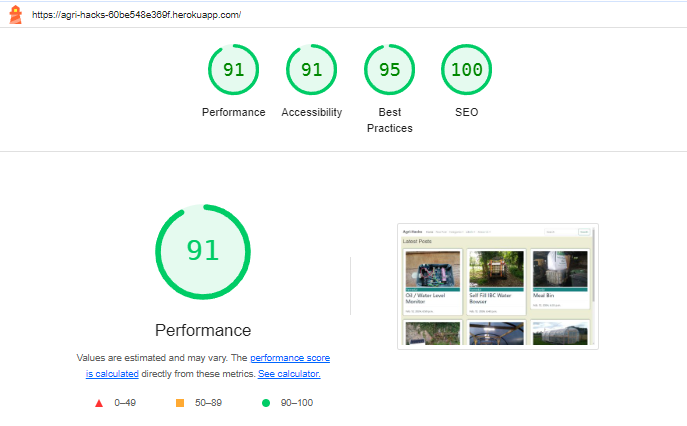

### Code Validation

Code has been run through the following validations tools.
- [W3 HTML Validator](https://validator.w3.org/)
- [CI Python Linter](https://pep8ci.herokuapp.com/)
- [W3 CSS Validator](https://jigsaw.w3.org/css-validator/validator.html.en)
- [JSHint ](https://jshint.com/)

[Back to Top of page](#contents)

## Bugs

#### Resolved Bugs
| Bug | Fix |
|--|--|
|Confirm Delete button not working|Removed extra form tags|
|Embedded videos not responsive|Add max-width to iFrames in CSS|
|Inconsistent image aspect ratios on home page| Create a div aspect ratio box and hide overflow with CSS|
|Error 500, logged out user clicks like / made_this|Disable buttons for logged out users|
|Summernote missing CSS in Widget|Manually add CSS|
|Picture uploads not working on Post Edit form| Add request.FILES to view and <form method='post' enctype='multipart/form-data'>to HTML |
|Conflict with POST and Comments Edit Buttons| Change Class name on Post Edit buttons|
|Issue with duplicate post titles|Use Django AutoSlugField and set slug unique = True|

#### UnResolved Bugs

| Bug | Comment |
|--|--|
|Post edit form not showing name of existing file uploaded|This does not effect the saving of the form with or without changing the image file. Time constraints prevented the fixing of this issue but it will be addressed in a future deployment.
|Page reloads on submitting a comment|Not a major issue, but UX would be improved by implementing a real-time update using HTMX or AJAX|  

[Back to Top of page](#contents)

## Deployment

To deploy the project through Heroku follow these steps:

### Create the Heroku App:

- Sign up / Log in to  [Heroku](https://www.heroku.com/)
- From  Heroku Dashboard page select 'New' and then 'Create New App'
- Give the project a name.
- After select create app. 
- The name for the app must be unique..
- Heroku will create the app and bring you to the deploy tab.

### Attach the Postgres database:
 
- Create an account with [ElephantSQL](https://elephantsql.com/) and sign up for Tiny Turtle Plan(free).
- Create a new instance.
- Check that Postgres version is 12 or over in Stats tab.
- Copy Database URL from Details Tab.
- Return to Heroku, Click on the setting tab.
- Open the config vars section add a variable named DATABASE_URL.
- Paste the Postgres URL to the value field.

### Prepare the environment and settings.py file:

- Inside the Django app repository create a new file called env.py
- Import the os library and set the environment variable for the DATABASE_URL pasting in the PostGres URL. 
- The line should appear as os.environ["DATABASE_URL"]= "Paste the link in here"
- Add a secret key to the app using os.environ["SECRET_KEY"] = "your secret key goes here"
- Add the secret key just created to the Heroku Config Vars as SECRET_KEY for the KEY value and the secret key value you created as the VALUE
- In the settings.py file within the django app, import Path from pathlib, import os and import dj_database_url
- insert the line if os.path.isfile("env.py"): import env
- remove the insecure secret key that django has in the settings file by default and replace it with SECRET_KEY = os.environ.get('SECRET_KEY')
- replace the databases section with DATABASES = { 'default': dj_database_url.parse(os.environ.get("DATABASE_URL"))} ensure the correct indentation for python is used.
- In the terminal migrate the models over to the new database connection

### Sign up Cloudinary for image hosting: 

- Go to [cloudinary](https://cloudinary.com), create an account and log in.
- From the dashboard - copy the CLOUDINARY_URL to the clipboard
- In the env.py file - add os.environ["CLOUDINARY_URL"] = "paste in the URL copied to the clipboard here"
- In Heroku, add the CLOUDINARY_URL and value copied to the clipboard to the config vars
- Also add the KEY - DISABLE_COLLECTSTATIC with the Value - 1 to the config vars
- this key value pair must be removed prior to final deployment
- Add the cloudinary libraries to the list of installed apps, the order they are inserted is important, 'cloudinary_storage' goes above 'django.contrib.staitcfiles' and 'cloudinary' goes below it.
- in the Settings.py file - add the STATIC files settings - the URL, storage path, directory path, root path, media URL and default file storage path.
- Link the file to the templates directory in Heroku TEMPLATES_DIR = os.path.join(BASE_DIR, 'templates')
- Change the templates directory to TEMPLATES_DIR - 'DIRS': [TEMPLATES_DIR]
- Add Heroku to the ALLOWED_HOSTS list the format will be the app name given in Heroku when creating the app followed by .herokuapp.com

### Create files / directories:

-   In your code editor, create three new top level folders, media, static, templates
-   Create a new file on the top level directory - Procfile
-   Within the Procfile add the code - web: guincorn PROJECT_NAME.wsgi
-   In the terminal, add the changed files, commit and push to GitHub

### Deploy:

-   NB: Ensure in Django settings, DEBUG is False
-   In Heroku, navigate to the deployment tab and deploy the branch manually - watch the build logs for any errors.
-   Heroku will now build the app for you. Once it has completed the build process you will see a 'Your App Was Successfully Deployed' message and a link to the app to visit the live site.

[Back to Top of page](#contents)

## Credits

- [© Ronyzmbow](https://www.stockfreeimages.com/) - Default Images
- [Alan Bushell](https://github.com/Alan-Bushell) - Readme template
- [blog.devgenius](https://blog.devgenius.io/django-and-htmx-part-1-ff629ae048f1#cb7d) - HTMX for Likes buttons
- [Bootstrap Docs](https://getbootstrap.com/docs/4.1/getting-started/introduction/) - Navbar / general bootstrap documentation
- [Django Docs](https://docs.djangoproject.com/en/5.0/) - Django
- [Favicon.io](https://favicon.io/") - Favicon
- [Code Institute WalkThroughs](https://learn.codeinstitute.net/dashboard) - Boiler plate code and more.

[Back to Top of page](#contents)

## Acknowledgements

- [FarmHack.org](https://farmhack.org/tools) - The inspiration for Agri-Hacks, site is still live in an archive state but no longer maintained.
- Mentor Antonio Rodriguez

[Back to Top of page](#contents)

## Content

- [Farmer-Eds-Shed.com](farmer-eds-shed.com) - Blog Post Content borrowed from my original Blog site.

[Back to Top of page](#contents)